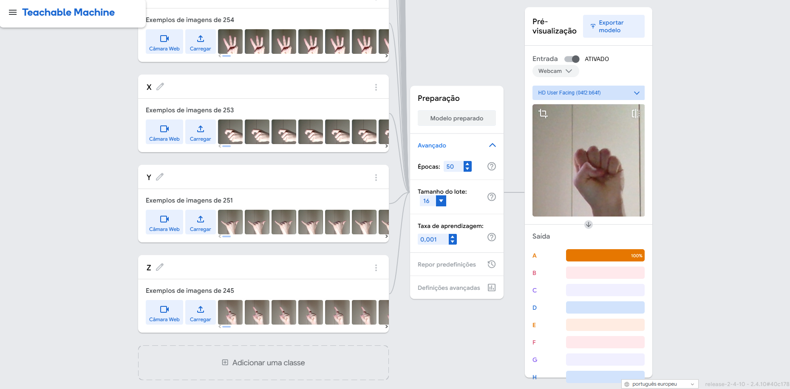
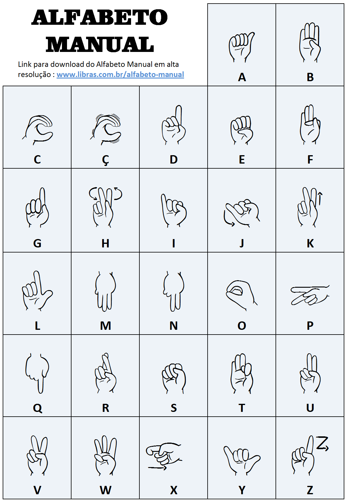

# 🤟 Reconhecimento de Gestos da Língua Brasileira de Sinais para Inclusão Educacional


Trabalho desenvolvido como **Projeto Final da disciplina de Sistemas Multimídias**, por mim **José Henrique Lopes Motta**.  
Este sistema realiza o reconhecimento de gestos do alfabeto da Língua Brasileira de Sinais (LIBRAS) utilizando **OpenCV**, **MediaPipe** e um modelo de classificação treinado em **TensorFlow/Keras**.  
O objetivo principal é promover a **inclusão educacional de pessoas surdas**, oferecendo uma aplicação interativa baseada em visão computacional.


---

## 📸 Demonstração


---

## 🚀 Tecnologias Utilizadas

- **Python** 3.8.0
- **TensorFlow** 2.8.0
- **MediaPipe** 0.10.5
- **OpenCV-Python** 4.6.0.66
- **Protobuf** 3.19.4
- Modelo `.h5` treinado com [Teachable Machine](https://teachablemachine.withgoogle.com/)

---

## ⚙️ Requisitos

Certifique-se de estar utilizando **Python 3.8.0** ou compatível com TensorFlow 2.8.0.  
Use um ambiente virtual para isolar as dependências.


### Conteúdo do `requirements.txt`

```txt
tensorflow==2.8.0
mediapipe==0.10.5
opencv-python==4.6.0.66
protobuf==3.19.4
```

> ⚠️ **Atenção:** Python 3.11 ou superior pode apresentar **incompatibilidades** com as versões utilizadas do TensorFlow (2.8.0) e MediaPipe (0.10.5).  
> ✅ Recomenda-se o uso do **Python 3.8.0**, versão testada e compatível com este projeto.


---

## ▶️ Como Rodar o Projeto

Clone o repositório:

```bash
git clone https://github.com/dev-josehenrique/ReconhecimentoLibras.git
cd ReconhecimentoLibras
```

Crie e ative o ambiente virtual:

```bash
python -m venv venv
venv\Scripts\activate    # Windows
source venv/bin/activate  # Linux / Mac
```

Instale as dependências:

```bash
pip install -r requirements.txt
```

Execute o programa:

```bash
python main.py
```

> Pressione **'q'** para encerrar a execução.

---

## 📂 Estrutura do Projeto

```
ReconhecimentoLibras/
│
├── main.py              # Código principal do sistema
├── keras_model.h5       # Modelo de reconhecimento treinado
├── requirements.txt     # Lista de dependências do projeto
└── README.md            # Documentação do projeto
```

**OBSERVAÇÃO**: para exibir as imagens no `README.md`,  
foi criada uma pasta chamada `img` dentro do projeto e os arquivos(imagens) foram colocados lá.  
Essa pasta **NÃO É NECESSÁRIA PARA A EXECUÇÃO DO SISTEMA**, servindo apenas para fins de documentação  
e exibição no GitHub.


---

## 📺 Vídeo e Imagens

Abaixo, demonstrações visuais do sistema em funcionamento:

- ✅ Vídeo demonstrando o **treinamento do modelo** e a realização de **gestos em Libras**  
  

- ✅ Imagem mostrando o sistema **testando o modelo treinado** e exibindo sua **precisão de predição**  
  

- ✅ Imagem com o **alfabeto em Libras** usado como base para o treinamento  
  


---

## 👨‍💻 Autor

<p align="left">
  
  <strong>José Henrique Lopes Motta</strong>
</p>

GitHub: [@dev-josehenrique](https://github.com/dev-josehenrique)<br>
Portfólio: [devjosehenrique.com.br](https://devjosehenrique.com.br)

---


## 🙏 Agradecimentos

Este projeto foi possível graças às seguintes bibliotecas, ferramentas e comunidades:

- [Google Teachable Machine](https://teachablemachine.withgoogle.com/) – Treinamento do modelo de reconhecimento de gestos
- [GitHub Teachable Machine](https://github.com/googlecreativelab/teachablemachine-community/) – Comunidade GitHub Teachable Machine
- [MediaPipe](https://chuoling.github.io/mediapipe/) – Detecção de mãos em tempo real
- [TensorFlow](https://www.tensorflow.org/) – Execução do modelo de machine learning (.h5)
- [Keras](https://keras.io/) – API de alto nível usada para construir e treinar o modelo
- [OpenCV-Python](https://opencv.org/) – Captura e exibição de vídeo, manipulação de imagem
- [NumPy](https://numpy.org/) – Manipulação de arrays e normalização de dados
- [Protobuf (Protocol Buffers)](https://developers.google.com/protocol-buffers) – Comunicação interna entre componentes do MediaPipe
- [Python](https://www.python.org/) – Linguagem base utilizada no desenvolvimento
- Comunidade Python e desenvolvedores de visão computacional, cujos tutoriais, fóruns e projetos serviram de referência e apoio
